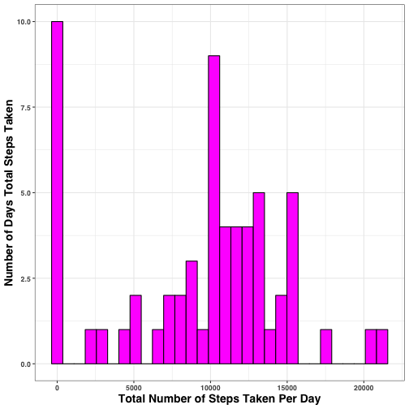
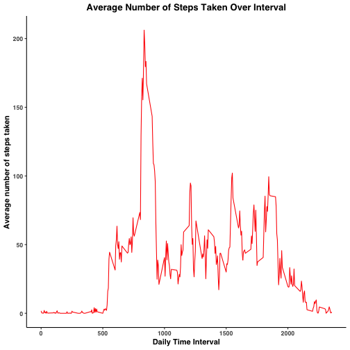
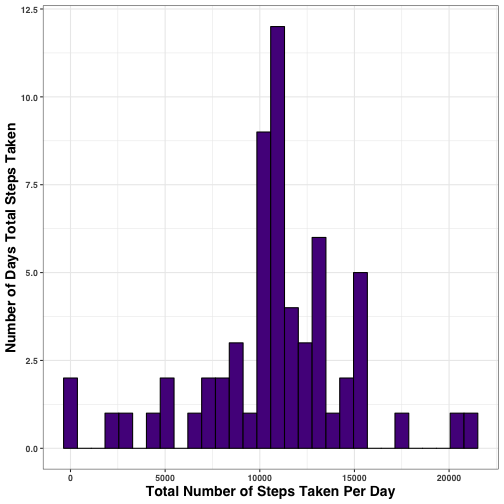
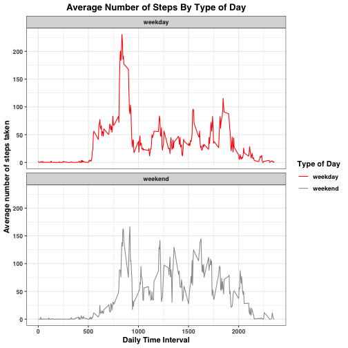

## R Markdown for Course Project 1  
Assignment submitted by Miranda L. Gardner  

### Read csv file in and inspect data


```r
#READ CSV AND EXAMINE STRUCTURE 
all_data <- read.csv("activity.csv", stringsAsFactors = F, header = T)
str(all_data)
```

```
## 'data.frame':	17568 obs. of  3 variables:
##  $ steps   : int  NA NA NA NA NA NA NA NA NA NA ...
##  $ date    : chr  "2012-10-01" "2012-10-01" "2012-10-01" "2012-10-01" ...
##  $ interval: int  0 5 10 15 20 25 30 35 40 45 ...
```


### What is the mean number of steps taken daily? 
Note: Ignore missing data reported as NA 


```r
#LOAD LIBRARY FOR PIPES, GROUPING AND SUMMARIZE FOR TOTAL STEPS, MEAN STEPS AND MEDIAN BY DAY
library(dplyr)
library(knitr)

df1 <- all_data %>%
  group_by(date) %>%
  summarize(total_steps = sum(steps, na.rm = T), 
            mean_steps = mean(steps, na.rm = T), 
            median_steps = median(steps, na.rm = T))
head(df1)
```

```
## # A tibble: 6 x 4
##   date       total_steps mean_steps median_steps
##   <chr>            <int>      <dbl>        <dbl>
## 1 2012-10-01           0    NaN               NA
## 2 2012-10-02         126      0.438            0
## 3 2012-10-03       11352     39.4              0
## 4 2012-10-04       12116     42.1              0
## 5 2012-10-05       13294     46.2              0
## 6 2012-10-06       15420     53.5              0
```


#### Histogram of Total Number of Steps Taken Daily


```r
#LOAD LIBRARY TO CREATE HISTOGRAM
library(ggplot2)
ggplot(df1, aes(x= total_steps)) + geom_histogram(color = "black", fill = "magenta") +
  labs(x = "Total Number of Steps Taken Per Day", y = "Number of Days Total Steps Taken") +
  theme_bw() +
  theme(text = element_text(family = "sans", face = "bold", color = "black"), 
        axis.title = element_text(size = 14)
        ) 
```

```
## `stat_bin()` using `bins = 30`. Pick better value with `binwidth`.
```




#### Report the Mean and Median Number of Steps Taken Per Day  

The mean number of steps taken per day:

```r
df2 <- df1 %>%
  select(date, mean_steps)
as.data.frame(df2)
```

```
##          date mean_steps
## 1  2012-10-01        NaN
## 2  2012-10-02  0.4375000
## 3  2012-10-03 39.4166667
## 4  2012-10-04 42.0694444
## 5  2012-10-05 46.1597222
## 6  2012-10-06 53.5416667
## 7  2012-10-07 38.2465278
## 8  2012-10-08        NaN
## 9  2012-10-09 44.4826389
## 10 2012-10-10 34.3750000
## 11 2012-10-11 35.7777778
## 12 2012-10-12 60.3541667
## 13 2012-10-13 43.1458333
## 14 2012-10-14 52.4236111
## 15 2012-10-15 35.2048611
## 16 2012-10-16 52.3750000
## 17 2012-10-17 46.7083333
## 18 2012-10-18 34.9166667
## 19 2012-10-19 41.0729167
## 20 2012-10-20 36.0937500
## 21 2012-10-21 30.6284722
## 22 2012-10-22 46.7361111
## 23 2012-10-23 30.9652778
## 24 2012-10-24 29.0104167
## 25 2012-10-25  8.6527778
## 26 2012-10-26 23.5347222
## 27 2012-10-27 35.1354167
## 28 2012-10-28 39.7847222
## 29 2012-10-29 17.4236111
## 30 2012-10-30 34.0937500
## 31 2012-10-31 53.5208333
## 32 2012-11-01        NaN
## 33 2012-11-02 36.8055556
## 34 2012-11-03 36.7048611
## 35 2012-11-04        NaN
## 36 2012-11-05 36.2465278
## 37 2012-11-06 28.9375000
## 38 2012-11-07 44.7326389
## 39 2012-11-08 11.1770833
## 40 2012-11-09        NaN
## 41 2012-11-10        NaN
## 42 2012-11-11 43.7777778
## 43 2012-11-12 37.3784722
## 44 2012-11-13 25.4722222
## 45 2012-11-14        NaN
## 46 2012-11-15  0.1423611
## 47 2012-11-16 18.8923611
## 48 2012-11-17 49.7881944
## 49 2012-11-18 52.4652778
## 50 2012-11-19 30.6979167
## 51 2012-11-20 15.5277778
## 52 2012-11-21 44.3993056
## 53 2012-11-22 70.9270833
## 54 2012-11-23 73.5902778
## 55 2012-11-24 50.2708333
## 56 2012-11-25 41.0902778
## 57 2012-11-26 38.7569444
## 58 2012-11-27 47.3819444
## 59 2012-11-28 35.3576389
## 60 2012-11-29 24.4687500
## 61 2012-11-30        NaN
```


The median number of steps taken per day:

```r
df3 <- df1 %>%
  select(date, median_steps)
as.data.frame(df3)
```

```
##          date median_steps
## 1  2012-10-01           NA
## 2  2012-10-02            0
## 3  2012-10-03            0
## 4  2012-10-04            0
## 5  2012-10-05            0
## 6  2012-10-06            0
## 7  2012-10-07            0
## 8  2012-10-08           NA
## 9  2012-10-09            0
## 10 2012-10-10            0
## 11 2012-10-11            0
## 12 2012-10-12            0
## 13 2012-10-13            0
## 14 2012-10-14            0
## 15 2012-10-15            0
## 16 2012-10-16            0
## 17 2012-10-17            0
## 18 2012-10-18            0
## 19 2012-10-19            0
## 20 2012-10-20            0
## 21 2012-10-21            0
## 22 2012-10-22            0
## 23 2012-10-23            0
## 24 2012-10-24            0
## 25 2012-10-25            0
## 26 2012-10-26            0
## 27 2012-10-27            0
## 28 2012-10-28            0
## 29 2012-10-29            0
## 30 2012-10-30            0
## 31 2012-10-31            0
## 32 2012-11-01           NA
## 33 2012-11-02            0
## 34 2012-11-03            0
## 35 2012-11-04           NA
## 36 2012-11-05            0
## 37 2012-11-06            0
## 38 2012-11-07            0
## 39 2012-11-08            0
## 40 2012-11-09           NA
## 41 2012-11-10           NA
## 42 2012-11-11            0
## 43 2012-11-12            0
## 44 2012-11-13            0
## 45 2012-11-14           NA
## 46 2012-11-15            0
## 47 2012-11-16            0
## 48 2012-11-17            0
## 49 2012-11-18            0
## 50 2012-11-19            0
## 51 2012-11-20            0
## 52 2012-11-21            0
## 53 2012-11-22            0
## 54 2012-11-23            0
## 55 2012-11-24            0
## 56 2012-11-25            0
## 57 2012-11-26            0
## 58 2012-11-27            0
## 59 2012-11-28            0
## 60 2012-11-29            0
## 61 2012-11-30           NA
```


### What is the average daily activity pattern?


```r
#GROUP DATA BY INTERVAL AND CALC MEAN NUMBER OF STEPS

df4 <- all_data %>%
  group_by(interval) %>%
  summarize(mean_steps = mean(steps, na.rm = T))
df4
```

```
## # A tibble: 288 x 2
##    interval mean_steps
##       <int>      <dbl>
##  1        0     1.72  
##  2        5     0.340 
##  3       10     0.132 
##  4       15     0.151 
##  5       20     0.0755
##  6       25     2.09  
##  7       30     0.528 
##  8       35     0.868 
##  9       40     0     
## 10       45     1.47  
## # … with 278 more rows
```

```r
#FIND MAX MEAN STEPS TO FIND THE INTERVAL THAT MAX OCCURS
max <- max(df4$mean_steps)
max_interval <- df4$interval[df4$mean_steps == max]
max_rd = round(max, digits = 3)
#PLOT DATA
 ggplot(df4, aes(x=interval, y=mean_steps)) +
  geom_line(col = "red") + 
   labs(x = "Daily Time Interval", y = "Average number of steps taken", 
        title  = "Average Number of Steps Taken Over Interval") +
   theme_classic() +
   theme(text = element_text(family = "sans", color = "black", face = "bold"), 
         plot.title = element_text(hjust = 0.5)
         )
```



#### Time Interval for Maximum Activity
The time interval that, on average, the maximum number of  206.17 steps occurs is: 835


### Imputing Missing Values


```r
#ADD UP TOTAL NUMBER OF MISSING VALUES
num_na <- sum(is.na(all_data))
```

#### Number of Missing Values
The total number of missing values is 2304


```r
#FIND INTERVAL MATCH FROM df4 TO all_data & USE mean_steps TO REPLACE NA
impute_match <- df4$mean_steps[match(all_data$interval, df4$interval)]
```


```r
#CREATE A NEW DATASET BY REPLACING NAs WITH MEAN FROM THE INTERVAL 
all_data_imputed <- transform(all_data, steps = ifelse(is.na(all_data$steps), yes = impute_match, no = all_data$steps))
```


```r
#GROUP DATA BY DATE, SUM DATA & CREATE HISTOGRAM OF IMPUTED DATA
imp_data <- all_data_imputed %>%
  group_by(date) %>%
  summarize(total_steps = sum(steps, na.rm = T), 
            mean_steps = mean(steps, na.rm = T), 
            median_steps = median(steps, na.rm = T))
head(imp_data)
```

```
## # A tibble: 6 x 4
##   date       total_steps mean_steps median_steps
##   <chr>            <dbl>      <dbl>        <dbl>
## 1 2012-10-01      10766.     37.4           34.1
## 2 2012-10-02        126       0.438          0  
## 3 2012-10-03      11352      39.4            0  
## 4 2012-10-04      12116      42.1            0  
## 5 2012-10-05      13294      46.2            0  
## 6 2012-10-06      15420      53.5            0
```

```r
ggplot(imp_data, aes(x= total_steps)) + 
  geom_histogram(color = "black", fill = "purple4") +
  labs(x = "Total Number of Steps Taken Per Day", y = "Number of Days Total Steps Taken") +
  theme_bw() +
  theme(text = element_text(family = "sans", face = "bold", color = "black"), 
        axis.title = element_text(size = 14)
        ) 
```

```
## `stat_bin()` using `bins = 30`. Pick better value with `binwidth`.
```



#### Report the Mean and Median Number of Steps Taken Per Day Post-Imputation

The mean number of steps taken per day:

```r
imp_data2 <- imp_data %>%
  select(date, mean_steps)
as.data.frame(imp_data2)
```

```
##          date mean_steps
## 1  2012-10-01 37.3825996
## 2  2012-10-02  0.4375000
## 3  2012-10-03 39.4166667
## 4  2012-10-04 42.0694444
## 5  2012-10-05 46.1597222
## 6  2012-10-06 53.5416667
## 7  2012-10-07 38.2465278
## 8  2012-10-08 37.3825996
## 9  2012-10-09 44.4826389
## 10 2012-10-10 34.3750000
## 11 2012-10-11 35.7777778
## 12 2012-10-12 60.3541667
## 13 2012-10-13 43.1458333
## 14 2012-10-14 52.4236111
## 15 2012-10-15 35.2048611
## 16 2012-10-16 52.3750000
## 17 2012-10-17 46.7083333
## 18 2012-10-18 34.9166667
## 19 2012-10-19 41.0729167
## 20 2012-10-20 36.0937500
## 21 2012-10-21 30.6284722
## 22 2012-10-22 46.7361111
## 23 2012-10-23 30.9652778
## 24 2012-10-24 29.0104167
## 25 2012-10-25  8.6527778
## 26 2012-10-26 23.5347222
## 27 2012-10-27 35.1354167
## 28 2012-10-28 39.7847222
## 29 2012-10-29 17.4236111
## 30 2012-10-30 34.0937500
## 31 2012-10-31 53.5208333
## 32 2012-11-01 37.3825996
## 33 2012-11-02 36.8055556
## 34 2012-11-03 36.7048611
## 35 2012-11-04 37.3825996
## 36 2012-11-05 36.2465278
## 37 2012-11-06 28.9375000
## 38 2012-11-07 44.7326389
## 39 2012-11-08 11.1770833
## 40 2012-11-09 37.3825996
## 41 2012-11-10 37.3825996
## 42 2012-11-11 43.7777778
## 43 2012-11-12 37.3784722
## 44 2012-11-13 25.4722222
## 45 2012-11-14 37.3825996
## 46 2012-11-15  0.1423611
## 47 2012-11-16 18.8923611
## 48 2012-11-17 49.7881944
## 49 2012-11-18 52.4652778
## 50 2012-11-19 30.6979167
## 51 2012-11-20 15.5277778
## 52 2012-11-21 44.3993056
## 53 2012-11-22 70.9270833
## 54 2012-11-23 73.5902778
## 55 2012-11-24 50.2708333
## 56 2012-11-25 41.0902778
## 57 2012-11-26 38.7569444
## 58 2012-11-27 47.3819444
## 59 2012-11-28 35.3576389
## 60 2012-11-29 24.4687500
## 61 2012-11-30 37.3825996
```


The median number of steps taken per day:

```r
imp_data3 <- imp_data %>%
  select(date, median_steps)
as.data.frame(imp_data3)
```

```
##          date median_steps
## 1  2012-10-01     34.11321
## 2  2012-10-02      0.00000
## 3  2012-10-03      0.00000
## 4  2012-10-04      0.00000
## 5  2012-10-05      0.00000
## 6  2012-10-06      0.00000
## 7  2012-10-07      0.00000
## 8  2012-10-08     34.11321
## 9  2012-10-09      0.00000
## 10 2012-10-10      0.00000
## 11 2012-10-11      0.00000
## 12 2012-10-12      0.00000
## 13 2012-10-13      0.00000
## 14 2012-10-14      0.00000
## 15 2012-10-15      0.00000
## 16 2012-10-16      0.00000
## 17 2012-10-17      0.00000
## 18 2012-10-18      0.00000
## 19 2012-10-19      0.00000
## 20 2012-10-20      0.00000
## 21 2012-10-21      0.00000
## 22 2012-10-22      0.00000
## 23 2012-10-23      0.00000
## 24 2012-10-24      0.00000
## 25 2012-10-25      0.00000
## 26 2012-10-26      0.00000
## 27 2012-10-27      0.00000
## 28 2012-10-28      0.00000
## 29 2012-10-29      0.00000
## 30 2012-10-30      0.00000
## 31 2012-10-31      0.00000
## 32 2012-11-01     34.11321
## 33 2012-11-02      0.00000
## 34 2012-11-03      0.00000
## 35 2012-11-04     34.11321
## 36 2012-11-05      0.00000
## 37 2012-11-06      0.00000
## 38 2012-11-07      0.00000
## 39 2012-11-08      0.00000
## 40 2012-11-09     34.11321
## 41 2012-11-10     34.11321
## 42 2012-11-11      0.00000
## 43 2012-11-12      0.00000
## 44 2012-11-13      0.00000
## 45 2012-11-14     34.11321
## 46 2012-11-15      0.00000
## 47 2012-11-16      0.00000
## 48 2012-11-17      0.00000
## 49 2012-11-18      0.00000
## 50 2012-11-19      0.00000
## 51 2012-11-20      0.00000
## 52 2012-11-21      0.00000
## 53 2012-11-22      0.00000
## 54 2012-11-23      0.00000
## 55 2012-11-24      0.00000
## 56 2012-11-25      0.00000
## 57 2012-11-26      0.00000
## 58 2012-11-27      0.00000
## 59 2012-11-28      0.00000
## 60 2012-11-29      0.00000
## 61 2012-11-30     34.11321
```


The mean and median from the imputed dataset differs from the original calculations but only on the dates where 'NA' was reported for the full day. There are still quite a bit of 0's (no activity) that are further influencing the data.

### Are there differences in activity patterns between weekdays and weekends?


```r
#ADD NEW COLUMN WEEKDAY TO TAG DATE AS WD OR WEN
all_data_imputed$day_of_week <- weekdays(as.Date(all_data_imputed$date))
all_data_imputed$day_type <- ifelse (all_data_imputed$day_of_week == "Saturday" | 
                                       all_data_imputed$day_of_week =="Sunday",
                                     "weekend", "weekday")
#GROUP DATA BY INTERVAL
activity_by_date <- aggregate(steps~interval + day_type, all_data_imputed, mean)

#LINE SERIES PLOT - FACET WRAP ON day_type

ggplot(activity_by_date, aes(x = interval, y = steps, color = day_type)) +
  geom_line() +
  facet_wrap(~day_type, ncol = 1, nrow = 2) +
  scale_color_manual(values = c("red", "gray60")) +
   labs(x = "Daily Time Interval", y = "Average number of steps taken",
        title  = "Average Number of Steps By Type of Day", color = "Type of Day") +
   theme_bw() +
   theme(text = element_text(family = "sans", color = "black", face = "bold"),
         plot.title = element_text(hjust = 0.5)
         )
```


